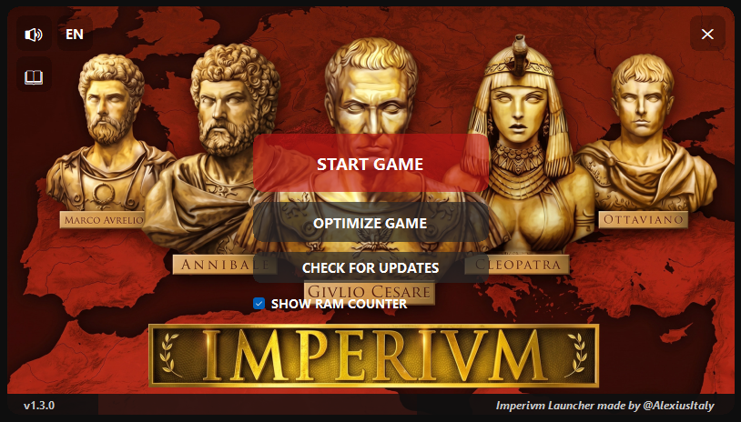

# Imperivm Launcher

> Screenshot example (English version). The launcher is also available in Spanish and Italian.

---

# English

## About

Imperivm Launcher is a free utility developed by **AlexiusItaly** to improve the experience of **Imperivm: Great Battles of Rome** on modern Windows systems.

The launcher was created for the Imperivm community with the goal of simplifying common fixes, automating configuration tasks, improving compatibility, and providing useful diagnostic tools for players.

This project is an unofficial community tool and does not claim ownership of Imperivm or any related intellectual property.

## Main Features

* One-click installation of the **4GB Large Address Aware (LAA) Patch**.
* Automatic installation of the **DirectMusic / Audio Fix** libraries.
* Real-time RAM monitoring while the game is running.
* Optional in-game RAM overlay.
* Automatic warnings when memory usage approaches critical limits.
* Automatic crash diagnosis based on generated log files.
* Detection of common issues such as:

  * Memory-related crashes.
  * Audio-related crashes.
  * Multiplayer desynchronization.
  * Generic game or map-script errors.
* Automatic launcher update checking.
* Automatic synchronization between launcher language and game language.
* Temporary DPI compatibility handling for modern displays.
* Integrated user manual.
* Multilingual interface:

  * English
  * Spanish
  * Italian

## Project Goal

The goal of Imperivm Launcher is to provide a simple and reliable all-in-one utility that helps players install, configure, troubleshoot, and enjoy the game with minimal effort.

Feedback, bug reports, and suggestions are always appreciated.

---

# Español

## Acerca del Proyecto

Imperivm Launcher es una utilidad gratuita desarrollada por **AlexiusItaly** para mejorar la experiencia de **Imperivm: Great Battles of Rome** en sistemas Windows modernos.

El objetivo del proyecto es simplificar la instalación de correcciones comunes, automatizar configuraciones técnicas, mejorar la compatibilidad y proporcionar herramientas de diagnóstico útiles para los jugadores.

Este proyecto es una herramienta no oficial creada para la comunidad y no reclama ningún derecho sobre Imperivm ni sobre sus contenidos.

## Funciones Principales

* Instalación con un clic del parche **4GB Large Address Aware (LAA)**.
* Instalación automática del **Audio Fix / DirectMusic**.
* Monitorización de RAM en tiempo real durante la partida.
* Contador de RAM opcional dentro del juego.
* Avisos automáticos cuando el uso de memoria se acerca a niveles críticos.
* Diagnóstico automático de errores mediante el análisis de registros.
* Detección de problemas comunes:

  * Errores por límite de memoria.
  * Problemas de audio.
  * Desincronizaciones multijugador.
  * Errores genéricos o de scripts de mapas.
* Comprobación automática de actualizaciones.
* Sincronización automática entre el idioma del launcher y el idioma del juego.
* Compatibilidad DPI automática para pantallas modernas.
* Manual integrado.
* Interfaz multilingüe:

  * Español
  * Inglés
  * Italiano

## Objetivo

El objetivo de Imperivm Launcher es ofrecer una solución sencilla y fiable para ayudar a los jugadores a instalar, configurar, diagnosticar y disfrutar del juego de la forma más cómoda posible.

Las sugerencias, pruebas e informes de errores son siempre bienvenidos.

---

# Italiano

## Informazioni sul Progetto

Imperivm Launcher è un'utilità gratuita sviluppata da **AlexiusItaly** per migliorare l'esperienza di **Imperivm: Le Grandi Battaglie di Roma** sui sistemi Windows moderni.

Il launcher è stato creato per la community di Imperivm con l'obiettivo di semplificare l'installazione delle correzioni più comuni, automatizzare configurazioni tecniche, migliorare la compatibilità del gioco e fornire strumenti di diagnostica utili ai giocatori.

Questo progetto è uno strumento non ufficiale realizzato per la community e non rivendica alcun diritto su Imperivm o sui relativi contenuti.

## Funzionalità Principali

* Installazione con un clic della **Patch 4GB Large Address Aware (LAA)**.
* Installazione automatica del **Fix Audio / DirectMusic**.
* Monitoraggio della RAM in tempo reale durante il gioco.
* Overlay RAM opzionale in-game.
* Avvisi automatici quando l'utilizzo della memoria si avvicina ai limiti critici.
* Diagnostica automatica dei crash tramite analisi dei log.
* Rilevamento di problemi comuni come:

  * Crash dovuti al limite di memoria.
  * Problemi audio.
  * Desincronizzazioni multiplayer.
  * Errori generici o legati agli script delle mappe.
* Controllo automatico degli aggiornamenti.
* Sincronizzazione automatica tra lingua del launcher e lingua del gioco.
* Gestione automatica della compatibilità DPI per monitor moderni.
* Manuale integrato.
* Interfaccia multilingua:

  * Italiano
  * Inglese
  * Spagnolo

## Obiettivo

L'obiettivo di Imperivm Launcher è fornire uno strumento semplice e affidabile che aiuti i giocatori a installare, configurare, diagnosticare e utilizzare il gioco nel modo più semplice possibile.

Feedback, segnalazioni di bug e suggerimenti sono sempre benvenuti.
