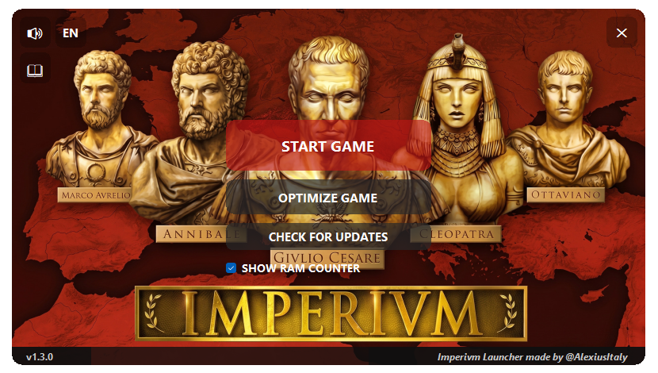

#  Imperivm Launcher

A free utility developed by **AlexiusItaly** to improve compatibility, stability, and usability of **Imperivm: Great Battles of Rome** on modern Windows systems.

## Languages

* [English](#english)
* [Español](#español)
* [Italiano](#italiano)

---

# English

## About

Imperivm Launcher is a free utility developed by **AlexiusItaly** to improve the experience of **Imperivm: Great Battles of Rome** on modern Windows systems.

The launcher was created for the Imperivm community to simplify common fixes, automate technical configurations, improve compatibility, and provide useful diagnostic tools for players.

This project is an unofficial community tool and does not claim ownership of Imperivm or any related intellectual property.

## Main Features

* One-click game optimization that automatically applies:

  * The **4GB Large Address Aware (LAA) Patch** when required.
  * The **DirectMusic / Audio Fix** files required by some modern Windows systems.
* Real-time monitoring of Imperivm's memory consumption.
* Visual display of the remaining memory available before reaching the game's practical memory limit.
* Optional in-game memory overlay.
* Automatic warnings when the game approaches critical memory usage levels.
* Automatic crash diagnosis based on generated log files.
* Detection of common issues such as:

  * Memory-related crashes.
  * Audio-related crashes.
  * Multiplayer desynchronization.
  * Generic game or map-script errors.
* Automatic launcher update checking.
* Automatic synchronization between launcher language and game language.
* Automatic temporary DPI compatibility handling for modern displays.
* Integrated user manual.
* Multilingual interface:

  * English
  * Spanish
  * Italian

## Project Goal

The goal of Imperivm Launcher is to provide a simple and reliable all-in-one utility that helps players install, configure, troubleshoot, and enjoy the game with minimal effort.

Feedback, bug reports, testing, and suggestions are always appreciated.

---

# Español

## Acerca del Proyecto

Imperivm Launcher es una utilidad gratuita desarrollada por **AlexiusItaly** para mejorar la experiencia de **Imperivm: Great Battles of Rome** en sistemas Windows modernos.

El launcher fue creado para la comunidad de Imperivm con el objetivo de simplificar correcciones habituales, automatizar configuraciones técnicas, mejorar la compatibilidad y proporcionar herramientas de diagnóstico útiles para los jugadores.

Este proyecto es una herramienta no oficial creada para la comunidad y no reclama ningún derecho sobre Imperivm ni sobre sus contenidos.

## Funciones Principales

* Optimización del juego con un solo clic que aplica automáticamente:

  * El parche **4GB Large Address Aware (LAA)** cuando es necesario.
  * Los archivos del **Audio Fix / DirectMusic** requeridos por algunos sistemas modernos.
* Monitorización en tiempo real del consumo de memoria de Imperivm.
* Visualización de la memoria restante antes de alcanzar el límite práctico del juego.
* Contador de memoria opcional durante la partida.
* Avisos automáticos cuando el juego se acerca a niveles críticos de uso de memoria.
* Diagnóstico automático de errores mediante el análisis de registros.
* Detección de problemas comunes:

  * Errores por límite de memoria.
  * Problemas de audio.
  * Desincronizaciones multijugador.
  * Errores genéricos o de scripts de mapas.
* Comprobación automática de actualizaciones.
* Sincronización automática entre el idioma del launcher y el idioma del juego.
* Compatibilidad DPI automática para pantallas modernas.
* Manual integrado.
* Interfaz multilingüe:

  * Español
  * Inglés
  * Italiano

## Objetivo

El objetivo de Imperivm Launcher es ofrecer una solución sencilla y fiable que ayude a los jugadores a instalar, configurar, diagnosticar y disfrutar del juego de la forma más cómoda posible.

Las sugerencias, pruebas e informes de errores son siempre bienvenidos.

---

# Italiano

## Informazioni sul Progetto

Imperivm Launcher è un'utilità gratuita sviluppata da **AlexiusItaly** per migliorare l'esperienza di **Imperivm: Le Grandi Battaglie di Roma** sui sistemi Windows moderni.

Il launcher è stato creato per la community di Imperivm con l'obiettivo di semplificare le correzioni più comuni, automatizzare configurazioni tecniche, migliorare la compatibilità del gioco e fornire strumenti di diagnostica utili ai giocatori.

Questo progetto è uno strumento non ufficiale realizzato per la community e non rivendica alcun diritto su Imperivm o sui relativi contenuti.

## Funzionalità Principali

* Ottimizzazione del gioco con un solo clic che applica automaticamente:

  * La **Patch 4GB Large Address Aware (LAA)** quando necessaria.
  * Il **Fix Audio / DirectMusic** richiesto da alcuni sistemi Windows moderni.
* Monitoraggio in tempo reale del consumo di memoria di Imperivm.
* Visualizzazione della memoria ancora disponibile prima di raggiungere il limite pratico del gioco.
* Overlay opzionale durante la partita.
* Avvisi automatici quando il gioco si avvicina a livelli critici di utilizzo della memoria.
* Diagnostica automatica dei crash tramite analisi dei log.
* Rilevamento di problemi comuni come:

  * Crash dovuti al limite di memoria.
  * Problemi audio.
  * Desincronizzazioni multiplayer.
  * Errori generici o legati agli script delle mappe.
* Controllo automatico degli aggiornamenti.
* Sincronizzazione automatica tra lingua del launcher e lingua del gioco.
* Gestione automatica e temporanea della compatibilità DPI per monitor moderni.
* Manuale integrato.
* Interfaccia multilingua:

  * Italiano
  * Inglese
  * Spagnolo

## Obiettivo

L'obiettivo di Imperivm Launcher è fornire uno strumento semplice e affidabile che aiuti i giocatori a installare, configurare, diagnosticare e utilizzare il gioco nel modo più semplice possibile.

Feedback, segnalazioni di bug, test e suggerimenti sono sempre benvenuti.
