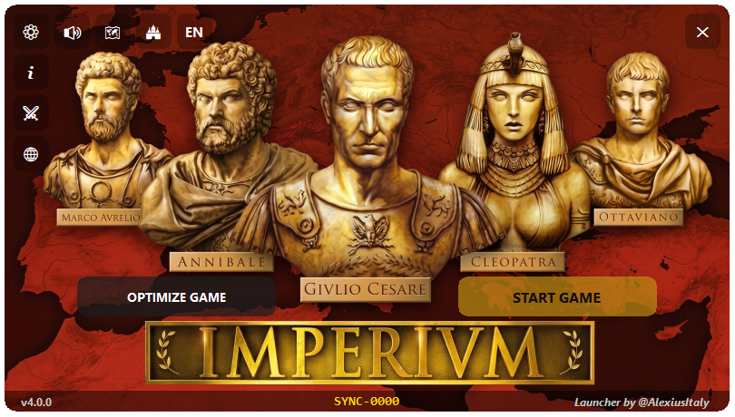

#  Imperivm Launcher

  **EN:** A free utility developed by **AlexiusItaly** to improve compatibility, stability, and usability of **Imperivm: Great Battles of Rome** on modern Windows systems. 
  
   **ES:** Una utilidad gratuita desarrollada por **AlexiusItaly** para mejorar la compatibilidad, estabilidad y facilidad de uso de **Imperivm: Great Battles of Rome** en sistemas Windows modernos. 
  
   **IT:** Un'utilità gratuita sviluppata da **AlexiusItaly** per migliorare la compatibilità, la stabilità e la fruibilità di **Imperivm: Le Grandi Battaglie di Roma** sui sistemi Windows moderni.

## 🌍 Languages & Navigation

|  [English](#english) |  [Español](#español) |  [Italiano](#italiano) |
| :--- | :--- | :--- |
| 📖 [About](#about) ⚙️ [System Requirements](#system-requirements) 🚀 [Instructions](#instructions) ✨ [Main Features](#main-features) 💬 [Support & Feedback](#support-bugs--feedback) | 📖 [Acerca del Proyecto](#acerca-del-proyecto) ⚙️ [Requisitos del Sistema](#requisitos-del-sistema) 🚀 [Instrucciones](#instrucciones) ✨ [Funciones Principales](#funciones-principales) 💬 [Soporte y Comentarios](#soporte-errores-y-comentarios) | 📖 [Informazioni](#informazioni-sul-progetto) ⚙️ [Requisiti di Sistema](#requisiti-di-sistema) 🚀 [Istruzioni](#istruzioni) ✨ [Funzionalità](#funzionalità-principali) 💬 [Supporto e Feedback](#supporto-bug-e-feedback) |

---

# English

## About

Imperivm Launcher is a free utility developed by **AlexiusItaly** to ensure the game is stable and fully compatible with modern operating systems. This tool acts as a unified hub: it automatically fixes common crashes, ensures the game displays correctly on high-resolution monitors, and provides a safe way to play community content. 

This project is an unofficial community tool and does not claim ownership of Imperivm or any related intellectual property.

## System Requirements
* **OS:** Windows 7 (32-bit) or higher.
* **Game:** A valid installation of *Imperivm: Great Battles of Rome*.

## Instructions
1. Download the latest release from the button at the top of this page.
2. Place the launcher executable in your Imperivm directory (where the `gbr.exe` file is located).
3. Run the launcher and use the intuitive interface to optimize, mod, and play the game!

## Main Features

**1. Launch, Patching & Customization**
* **Native DPI Management:** Automatically disables Windows display scaling to prevent blurry UI elements on modern high-resolution displays.
* **1-Click Game Optimization:** Permanently applies the **4GB RAM Patch** (preventing out-of-memory crashes), injects legacy **Audio/DirectMusic Fixes** (preventing instant crashes on Win 10/11), and permanently fixes the infamous 2005 random crash 'Couldn't find or parse map file' by patching the 'ghost tree' null pointer directly in the game's assembly code.
* **Full-HD (1080p) Support:** Automatically extracts and applies the Full-HD pack to run the vanilla base game perfectly in 1080p resolution.
* **Performance & Graphics:** Optional toggles for **CPU Optimization** (reduces stuttering) and **HD Graphics** (dynamic contrast filters to reduce pixelation).
* **RAM Watchdog:** Real-time memory monitoring with an in-game overlay and automatic warnings when approaching the engine's limits.
* **Factory Reset:** A dedicated tool (🧹) to instantly wipe all active settings, mods, and network rules, restoring the game to its pristine original state.
* **Discord Rich Presence:** Show your current game status, avatar, and profile directly on Discord.
* **Smart Diagnostics:** Automatic crash diagnosis based on log files.

**2. Cloud Adventures Manager**
* **Built-in Cloud Catalog:** Browse, download, and update custom community single-player campaigns.
* **Smart Synchronization:** Automatically detects installed maps and notifies you when map-makers release new updates.
* **Zero-Touch Installation:** Download multiple language-filtered maps at once; the launcher automatically extracts and places audio, text, and scenario files in their correct native folders.

**3. Epic Conquests Manager**
* **Large-Scale Campaigns:** Browse and download massive, community-created Conquests directly from the launcher.
* **Simplified Setup:** The system automatically handles complex file placements and integrates the campaigns seamlessly into your game without requiring manual file manipulation.

**4. Integrated Mod Manager**
* **Safe Installation:** Create a secure, AES-encrypted "Vanilla Backup" of your pristine game files before modding.
* **Runtime Injection:** Mods are safely loaded into memory while playing. The launcher handles all folder cleaning and backup restorations automatically, keeping your base game 100% safe.
* **Instant Toggle:** Switch between massive graphical overhauls, balance mods, or the vanilla base game with a single click, without manually moving any files.

**5. Automated Multiplayer Hub**
* **Invisible Installation:** Automatically downloads and installs Radmin VPN silently in the background if missing.
* **Smart Network Routing:** Solves the infamous "invisible lobbies" issue. With one click, the launcher configures the Windows Firewall and forces the VPN interface to Maximum Priority (Metric 1), ensuring direct routing and zero lag.
* **Real-Time Ping Monitor:** A built-in visual indicator displays your Radmin VPN ping directly in the launcher, helping you verify connection stability before starting a match.
* **Auto-Cleanup:** Safely restores default Windows network priorities and terminates the VPN process the moment you close the launcher.

**6. General Quality of Life**
* Automatic launcher update checking.
* Automatic synchronization between launcher language and game language.
* Multilingual interface: English, Spanish, Italian, Czech.

## Support, Bugs & Feedback
The goal of Imperivm Launcher is to provide a simple and reliable all-in-one utility that helps players install, configure, troubleshoot, and enjoy the game with minimal effort. 

For any questions, feature requests, or bug reports, please open an issue in the **[GitHub Issues](https://github.com/AlexiusItaly/ImperivmLauncher/issues)** section of this repository. Detail your suggestion, bug, or idea, and I will reply as soon as possible!

---

# Español

## Acerca del Proyecto

Imperivm Launcher es una utilidad gratuita desarrollada por **AlexiusItaly** para garantizar que el juego sea estable y totalmente compatible con los sistemas operativos modernos. Esta herramienta actúa como un centro unificado: soluciona automáticamente los bloqueos comunes, asegura que el juego se vea correctamente en monitores de alta resolución y ofrece una forma segura de jugar al contenido de la comunidad.

Este proyecto es una herramienta no oficial creada para la comunidad y no reclama ningún derecho sobre Imperivm ni sobre sus contenidos.

## Requisitos del Sistema
* **SO:** Windows 7 (32-bit) o superior.
* **Juego:** Una instalación válida de *Imperivm: Great Battles of Rome*.

## Instrucciones
1. Descarga la última versión desde el botón de arriba de esta página.
2. Coloca el ejecutable del launcher en la carpeta de Imperivm (donde se encuentra el archivo `gbr.exe`).
3. ¡Inicia el launcher y usa la interfaz para optimizar, instalar mods y jugar!

## Funciones Principales

**1. Inicio, Parche y Personalización**
* **Gestión Nativa DPI:** Desactiva automáticamente el escalado de Windows para evitar interfaces y textos borrosos en monitores de alta resolución.
* **Optimización en 1 Clic:** Aplica el parche de **4GB de RAM** (evitando cuelgues por falta de memoria), las librerías clásicas de **Audio/DirectMusic** (evitando cierres al iniciar en Win 10/11), y soluciona definitivamente el famoso cuelgue aleatorio de 2005 'Couldn't find or parse map file', parcheando el problema del 'árbol fantasma' directamente en el código assembly del juego.
* * **Soporte 1080p Nativo:** Extrae y aplica automáticamente el paquete Full-HD para ejecutar el juego base vanilla en resolución 1080p.
* **Rendimiento y Gráficos:** Ajustes opcionales para **Optimización de CPU** (reduce tirones) y **Gráficos HD** (filtros dinámicos para reducir la pixelación).
* **Monitor RAM (Watchdog):** Monitorización en tiempo real con un panel durante la partida y avisos automáticos al acercarse a los límites del motor.
* **Restauración de Fábrica:** Herramienta dedicada (🧹) para eliminar al instante mods, ajustes y reglas de red, restaurando el juego a su estado original.
* **Discord Rich Presence:** Muestra tu estado de juego actual, avatar y perfil directamente en Discord.
* **Diagnóstico Inteligente:** Análisis automático de errores basado en registros del juego.

**2. Gestor de Aventuras en la Nube**
* **Catálogo Integrado:** Explora, descarga y actualiza campañas personalizadas de la comunidad.
* **Sincronización Inteligente:** Detecta automáticamente los mapas instalados y te avisa cuando los creadores lanzan actualizaciones.
* **Instalación Automatizada:** Descarga varios mapas filtrados por idioma a la vez; el lanzador extrae y coloca automáticamente los archivos de audio, texto y escenario en sus carpetas correctas.

**3. Gestor de Conquistas Épicas**
* **Campañas a Gran Escala:** Explora y descarga enormes Conquistas creadas por la comunidad directamente desde el lanzador.
* **Configuración Simplificada:** El sistema maneja automáticamente la ubicación de archivos complejos y los integra de forma fluida en tu juego sin necesidad de manipular archivos manualmente.

**4. Gestor de Mods Integrado**
* **Instalación Segura:** Crea una "Copia Vanilla" segura y encriptada de tus archivos originales antes de aplicar cualquier mod.
* **Inyección en Ejecución:** Los mods se cargan de forma segura mientras juegas. El lanzador limpia las carpetas y restaura las copias automáticamente, manteniendo el juego base 100% a salvo.
* **Activación Rápida:** Alterna entre grandes mejoras gráficas, mods de balance o el juego original con un solo clic, sin mover archivos manualmente.

**5. Hub Multijugador Automatizado**
* **Instalación Invisible:** Descarga e instala Radmin VPN silenciosamente en segundo plano si no lo tienes.
* **Enrutamiento de Red Inteligente:** Soluciona el problema de las "salas invisibles". Con un clic, el lanzador configura el Firewall y fuerza la interfaz VPN a Prioridad Máxima (Métrica 1), garantizando visibilidad y cero lag.
* **Monitor de Ping en Tiempo Real:** Un indicador visual integrado muestra tu ping de Radmin VPN directamente en el lanzador, ayudándote a verificar la estabilidad de la conexión antes de empezar una partida.
* **Limpieza Automática:** Restaura las prioridades de red de Windows y cierra el proceso VPN de forma segura al cerrar el lanzador.

**6. Calidad de Vida (General)**
* Comprobación automática de actualizaciones del lanzador.
* Sincronización automática entre el idioma del launcher y el idioma del juego.
* Interfaz multilingüe: Español, Inglés, Italiano, Checo.

## Soporte, Errores y Comentarios
El objetivo de Imperivm Launcher es ofrecer una solución sencilla y fiable que ayude a los jugadores a instalar, configurar, diagnosticar y disfrutar del juego de la forma más cómoda posible.

Para preguntas, solicitudes de nuevas funciones o reportes de errores, por favor abre un *Issue* en la sección de **[GitHub Issues](https://github.com/AlexiusItaly/ImperivmLauncher/issues)** de este repositorio. ¡Cuéntame tu sugerencia, bug o idea y te responderé lo antes posible!

---

# Italiano

## Informazioni sul Progetto

Imperivm Launcher è un'utilità gratuita sviluppata da **AlexiusItaly** per garantire che il gioco sia stabile e perfettamente compatibile con i moderni sistemi operativi. Questo strumento funziona come un hub unificato: corregge in automatico i crash più comuni, garantisce che il gioco si veda correttamente sui monitor ad alta risoluzione e offre un modo sicuro per utilizzare i contenuti creati dalla community.

Questo progetto è uno strumento non ufficiale realizzato per la community e non rivendica alcun diritto su Imperivm o sui relativi contenuti.

## Requisiti di Sistema
* **OS:** Windows 7 (32-bit) o versioni successive.
* **Gioco:** Un'installazione valida di *Imperivm: Le Grandi Battaglie di Roma*.

## Istruzioni
1. Scarica l'ultima release dal pulsante in alto in questa pagina.
2. Posiziona l'eseguibile del launcher nella cartella di Imperivm (dove si trova il file `gbr.exe`).
3. Avvia il launcher e usa l'interfaccia per ottimizzare, applicare mod e giocare!

## Funzionalità Principali

**1. Avvio, Patch e Personalizzazione**
* **Gestione DPI Nativa:** Disattiva automaticamente il ridimensionamento di Windows per evitare interfacce sfocate sui moderni monitor ad alta risoluzione.
* **Ottimizzazione in 1 Clic:** Applica la **Patch 4GB RAM** (prevenendo i crash per memoria esaurita), i vecchi file **Audio/DirectMusic** (risolvendo le chiusure istantanee all'avvio su Win 10/11) e risolve definitivamente il famigerato crash casuale del 2005 'Couldn't find or parse map file', correggendo il problema del puntatore nullo ('albero fantasma') direttamente nel codice assembly del gioco.
* * **Supporto Nativo 1080p:** Estrae e applica in automatico il pacchetto Full-HD per giocare alla versione base vanilla in risoluzione 1080p.
* **Prestazioni e Grafica:** Impostazioni opzionali per la **Stabilità CPU** (riduce i microscatti) e **Grafica HD** (filtri di contrasto dinamico per ridurre l'effetto pixel).
* **Monitoraggio RAM (Watchdog):** Controllo in tempo reale dell'uso della memoria con indicatore a schermo e avvisi automatici vicino al limite del motore.
* **Ripristino di Fabbrica:** Strumento dedicato (🧹) per spazzare via istantaneamente impostazioni, mod e regole di rete, riportando il gioco al suo stato originale e pulito.
* **Discord Rich Presence:** Mostra il tuo stato di gioco in tempo reale, avatar e profilo direttamente su Discord.
* **Diagnostica Intelligente:** Riconoscimento automatico della causa dei crash tramite i log.

**2. Gestore Avventure Cloud**
* **Catalogo Integrato:** Esplora, scarica e aggiorna campagne e mappe personalizzate dalla community.
* **Sincronizzazione Smart:** Rileva automaticamente le mappe installate e avvisa non appena un autore pubblica un aggiornamento.
* **Installazione Trasparente:** Scarica più mappe contemporaneamente; il launcher si occupa da solo di estrarre e posizionare audio, testi e file di scenario nelle corrette cartelle native.

**3. Gestore Conquiste Epiche**
* **Campagne su Larga Scala:** Esplora e scarica enormi Conquiste create dalla community direttamente dal launcher.
* **Setup Semplificato:** Il sistema gestisce in automatico il posizionamento dei file complessi, integrandoli perfettamente nel gioco senza richiedere alcuna manipolazione manuale.

**4. Gestore Mod Integrato**
* **Installazione Sicura:** Crea un "Backup Vanilla" crittografato e sicuro dei file originali del gioco prima di applicare qualsiasi modifica.
* **Iniezione a Runtime:** Le mod vengono caricate in modo sicuro. Il launcher gestisce in automatico la pulizia delle cartelle e i ripristini, mantenendo il gioco base sempre intatto al 100%.
* **Attivazione Rapida:** Passa da enormi mod grafiche al gioco base originale con un solo clic, senza mai spostare file manualmente.

**5. Hub Multiplayer Automatizzato**
* **Installazione Invisibile:** Scarica e installa Radmin VPN in modo silenzioso in background se non è presente sul PC.
* **Routing di Rete Intelligente:** Risolve il problema delle "lobby invisibili". Con un clic, il launcher configura il Firewall e forza la rete VPN a Priorità Massima (Metrica 1), garantendo connessione diretta e zero lag.
* **Monitoraggio Ping in Tempo Reale:** Un indicatore visivo integrato mostra il tuo ping su Radmin VPN direttamente nel launcher, aiutandoti a verificare la stabilità della connessione prima di iniziare a giocare.
* **Pulizia Automatica:** Ripristina le normali priorità di rete di Windows e chiude in totale sicurezza il programma VPN non appena chiudi il launcher.

**6. Funzionalità Generali**
* Controllo automatico degli aggiornamenti del launcher.
* Sincronizzazione automatica tra lingua del launcher e lingua del gioco.
* Interfaccia multilingua: Italiano, Inglese, Spagnolo, Ceco.

## Supporto, Bug e Feedback
L'obiettivo di Imperivm Launcher è fornire uno strumento semplice e affidabile che aiuti i giocatori a installare, configurare, diagnosticare e utilizzare il gioco nel modo più semplice possibile.

Per domande, richieste di nuove funzionalità o segnalazioni di bug, scrivi una issue nella sezione **[GitHub Issues](https://github.com/AlexiusItaly/ImperivmLauncher/issues)** di questa pagina. Dimmi qual è il tuo suggerimento, il bug che hai trovato o la tua idea e ti risponderò il prima possibile!
